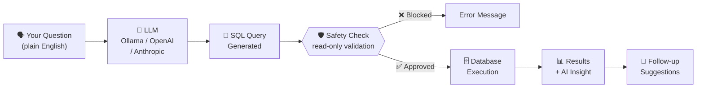
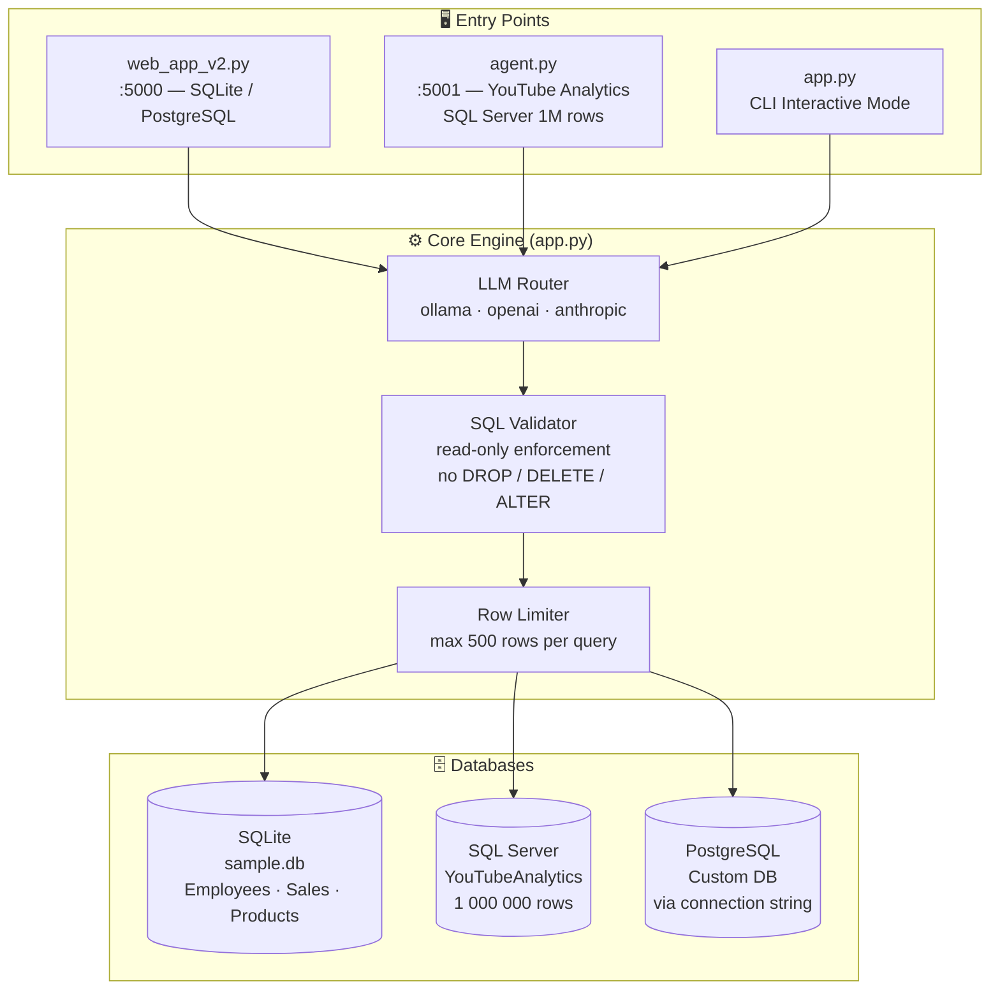
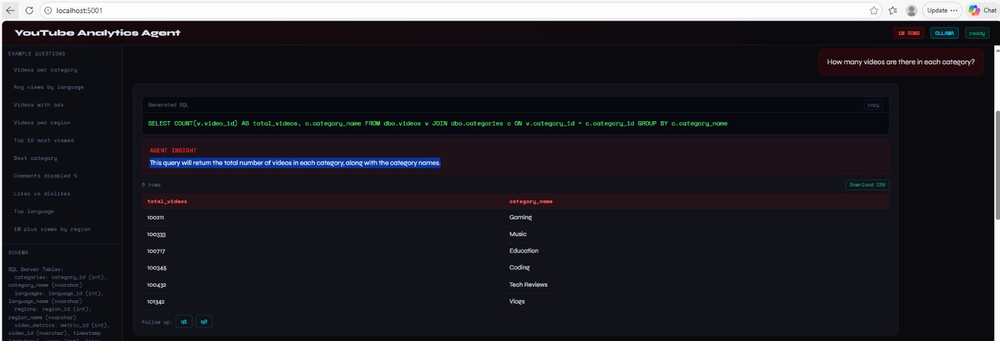
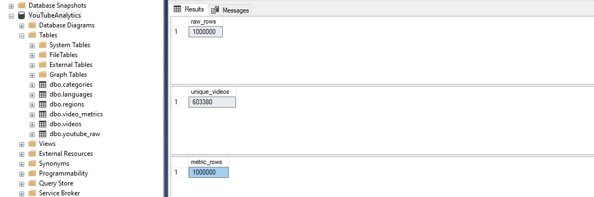

# AymenOu SQL Studio — YouTube Analytics Agent

> Ask your database anything in plain English. The AI writes the SQL, runs it, and gives you insights — 100% offline.

[](https://python.org)
[](https://flask.palletsprojects.com)
[](https://ollama.ai)
[](https://www.microsoft.com/sql-server)
[](LICENSE)

---

## What Is This?

A fully **offline** AI-powered tool that converts natural language questions into SQL queries and runs them directly against your database.

**No cloud. No subscriptions. No data leaves your machine.**

```
You ask  →  "Which category has the highest average views?"

AI writes →  SELECT c.category_name, AVG(m.views) AS avg_views
             FROM dbo.video_metrics m
             JOIN dbo.videos v   ON m.video_id = v.video_id
             JOIN dbo.categories c ON v.category_id = c.category_id
             GROUP BY c.category_name
             ORDER BY avg_views DESC

You get  →  Result table + business insight + suggested follow-up questions
```

---

## How It Works



---

## Architecture



---

## Screenshots

### Natural Language → SQL Query


### Database Statistics — 1M rows processed


---

## Features

| Feature | web_app_v2.py | agent.py | app.py (CLI) |
|---|:---:|:---:|:---:|
| Natural language to SQL | ✅ | ✅ | ✅ |
| AI-generated insights | ✅ | ✅ | ✅ |
| Follow-up suggestions | ✅ | ✅ | ❌ |
| Schema viewer (sidebar) | ✅ | ✅ | ❌ |
| Export CSV | ✅ | ✅ | ❌ |
| Export SQL + Result report | ✅ | ❌ | ❌ |
| SQLite support | ✅ | ❌ | ✅ |
| SQL Server support | ❌ | ✅ | ❌ |
| PostgreSQL support | ✅ | ❌ | ❌ |
| 100% offline (Ollama) | ✅ | ✅ | ✅ |

---

## Project Structure

```
sql-ai-agent/
│
├── app.py              ← Core engine: LLM backends, SQL runner, security layer
├── agent.py            ← YouTube Analytics Agent (SQL Server, 1M rows)  :5001
├── web_app_v2.py       ← General web UI (SQLite + PostgreSQL)            :5000
│
├── env.example.txt     ← Environment variables template (copy → .env)
├── requirements.txt    ← Python dependencies
│
├── DEMO_SCRIPT.md      ← 5-minute live demo guide
├── INSTALL_FR.md       ← French installation guide
│
└── data/
    └── sample.db       ← Auto-generated SQLite database (created on first run)
```

---

## Tech Stack

| Layer | Technology |
|---|---|
| Language | Python 3.8+ |
| AI (offline) | Ollama — llama3.2 (runs on CPU, no GPU needed) |
| AI (optional cloud) | OpenAI GPT-4o-mini · Anthropic Claude Haiku |
| Web Framework | Flask |
| Local Database | SQLite — employees, sales, products (auto-created) |
| Production Database | SQL Server via pyodbc |
| Optional Database | PostgreSQL via psycopg2 |
| Frontend | HTML + CSS + Vanilla JavaScript |
| Security | Read-only SQL validation, row limiter, keyword blocklist |

---

## Quick Start

### 1. Clone the repo

```bash
git clone https://github.com/AymenOuhiba/sql-ai-agent.git
cd sql-ai-agent
```

### 2. Create virtual environment

```bash
python -m venv venv

# Windows
venv\Scripts\activate

# Mac / Linux
source venv/bin/activate
```

### 3. Install dependencies

```bash
pip install -r requirements.txt
```

### 4. Install Ollama — the offline AI engine

Download from [ollama.ai](https://ollama.ai), then pull the model:

```bash
ollama pull llama3.2
```

> Downloads ~2 GB once. After that, everything runs fully offline with no internet.

### 5. Configure environment

```bash
# Windows
copy env.example.txt .env

# Mac / Linux
cp env.example.txt .env
```

Then edit `.env`:

```env
AYMENOU_SQL_SERVER=YOUR_SERVER_NAME\SQLEXPRESS
AYMENOU_SQL_DATABASE=YouTubeAnalytics
```

### 6. Run

```bash
# Option A — YouTube Analytics Agent (SQL Server)
python agent.py
# → http://localhost:5001

# Option B — General web UI (SQLite / PostgreSQL)
python web_app_v2.py
# → http://localhost:5000

# Option C — Command line
python app.py
```

---

## YouTube Analytics Database

Dataset: [YouTube 1M Global Creator Analytics — Kaggle](https://www.kaggle.com/datasets/ehsanzx/youtube-1m-global-creator-analytics)

### Database Schema

```
┌─────────────┐       ┌────────────────┐       ┌───────────────┐
│  categories │       │     videos     │       │  video_metrics│
│─────────────│       │────────────────│       │───────────────│
│ category_id │◄──PK──│ video_id    PK │──PK──►│ metric_id  PK │
│ category_name│      │ category_id FK │       │ video_id   FK │
└─────────────┘       │ language_id FK │       │ timestamp     │
                      │ region_id   FK │       │ views         │
┌─────────────┐       │ duration_sec   │       │ likes         │
│  languages  │       │ ads_enabled    │       │ comments      │
│─────────────│       └────────────────┘       │ shares        │
│ language_id │◄──PK──────────────┘            │ sentiment_score│
│ language_name│                               └───────────────┘
└─────────────┘
                                        ┌──────────────────────┐
┌─────────────┐                         │     youtube_raw      │
│   regions   │                         │──────────────────────│
│─────────────│                         │ Raw CSV import table │
│ region_id   │◄──PK──────────────┘     │ 1 000 000 rows       │
│ region_name │                         └──────────────────────┘
└─────────────┘
```

### Example Questions to Try

```sql
-- Engagement
"Which category has the highest average views?"
"Top 10 most viewed videos"
"Average likes and comments per category"

-- Distribution
"How many videos are there in each category?"
"What is the total number of videos in each region?"
"Which language has the most videos?"

-- Filters
"How many videos have ads enabled?"
"Show videos with over 1 million views by region"
"What percentage of videos have comments disabled?"
```

---

## Security Layer

Every query passes through a 3-step safety chain before touching the database:

```
User input
    │
    ▼
┌──────────────────────────────────────┐
│  1. validate_read_only_sql()         │  Blocks INSERT · UPDATE · DELETE
│                                      │         DROP · ALTER · TRUNCATE · EXEC
│                                      │  Blocks stacked statements (;)
└───────────────────┬──────────────────┘
                    │ ✅ passes
                    ▼
┌──────────────────────────────────────┐
│  2. BLOCKED_SQL_PATTERN (regex)      │  Secondary keyword blocklist
│                                      │  catches obfuscated patterns
└───────────────────┬──────────────────┘
                    │ ✅ passes
                    ▼
┌──────────────────────────────────────┐
│  3. ensure_row_limit()               │  Adds LIMIT N   (SQLite / PostgreSQL)
│                                      │  Adds TOP N     (SQL Server)
│                                      │  Max rows: AYMENOU_MAX_QUERY_ROWS
└───────────────────┬──────────────────┘
                    │
                    ▼
              Database query
```

---

## Switching AI Models

```bash
ollama pull llama3.3
ollama pull mistral
ollama pull deepseek-coder
```

```env
# In .env
AYMENOU_OLLAMA_MODEL=llama3.3
```

| Model | Size | Speed | Best For |
|---|---|---|---|
| `llama3.2` *(default)* | ~2 GB | Fast | Balanced — good start |
| `llama3.3` | ~4 GB | Medium | Better SQL accuracy |
| `mistral` | ~4 GB | Fastest | Quick answers |
| `deepseek-coder` | ~4 GB | Medium | SQL & code specialization |

**Switch to cloud AI** (requires API key):

```env
AYMENOU_LLM_BACKEND=openai
AYMENOU_OPENAI_API_KEY=sk-...

# or
AYMENOU_LLM_BACKEND=anthropic
AYMENOU_ANTHROPIC_API_KEY=sk-ant-...
```

---

## Environment Variables

| Variable | Default | Description |
|---|---|---|
| `AYMENOU_LLM_BACKEND` | `ollama` | AI backend: `ollama` · `openai` · `anthropic` |
| `AYMENOU_OLLAMA_MODEL` | `llama3.2` | Ollama model name |
| `AYMENOU_OLLAMA_URL` | `http://localhost:11434/api/generate` | Ollama API endpoint |
| `AYMENOU_SQL_SERVER` | `localhost\SQLEXPRESS` | SQL Server instance name |
| `AYMENOU_SQL_DATABASE` | `YouTubeAnalytics` | SQL Server database name |
| `AYMENOU_DB_PATH` | `data/sample.db` | SQLite file path (web_app_v2) |
| `AYMENOU_MAX_QUERY_ROWS` | `500` | Max rows returned per query |
| `AYMENOU_FLASK_DEBUG` | `0` | Set `1` for local dev only |
| `AYMENOU_OPENAI_API_KEY` | *(none)* | Required when backend = `openai` |
| `AYMENOU_ANTHROPIC_API_KEY` | *(none)* | Required when backend = `anthropic` |

---

## Requirements

- Python 3.8+
- [Ollama](https://ollama.ai) installed and running
- [ODBC Driver 17 for SQL Server](https://aka.ms/odbc17) *(agent.py only)*
- SQL Server Express *(agent.py only)*

---

## Troubleshooting

| Problem | Fix |
|---|---|
| `ollama not found` | Add Ollama to PATH or restart your terminal |
| `pyodbc error` | `pip install pyodbc` |
| `ODBC Driver missing` | Download from [aka.ms/odbc17](https://aka.ms/odbc17) |
| SQL Server not connecting | Verify `AYMENOU_SQL_SERVER` in `.env` matches SSMS |
| Slow first response | Normal — Ollama runs on CPU, expect 30–90 s |
| Port already in use | Change `port=5001` in `agent.py` to a free port |
| Model not found | Run `ollama pull llama3.2` first |

---

## Presentation Ready

| Resource | Description |
|---|---|
| [DEMO_SCRIPT.md](DEMO_SCRIPT.md) | 5-minute live demo walkthrough |
| [INSTALL_FR.md](INSTALL_FR.md) | Guide d'installation en français |

**Suggested demo flow:**
1. Start `python agent.py` (`http://localhost:5001`)
2. Ask: *"Which category has the highest average views?"*
3. Show the generated SQL, result table, AI insight
4. Click **Export SQL + Result** → download the report
5. Show the safety layer: type `DROP TABLE videos` → watch it get blocked

---

## License

MIT License — free to use, modify, and share.

---

*Built by AymenOu · Python · Ollama · Flask · SQL Server*
